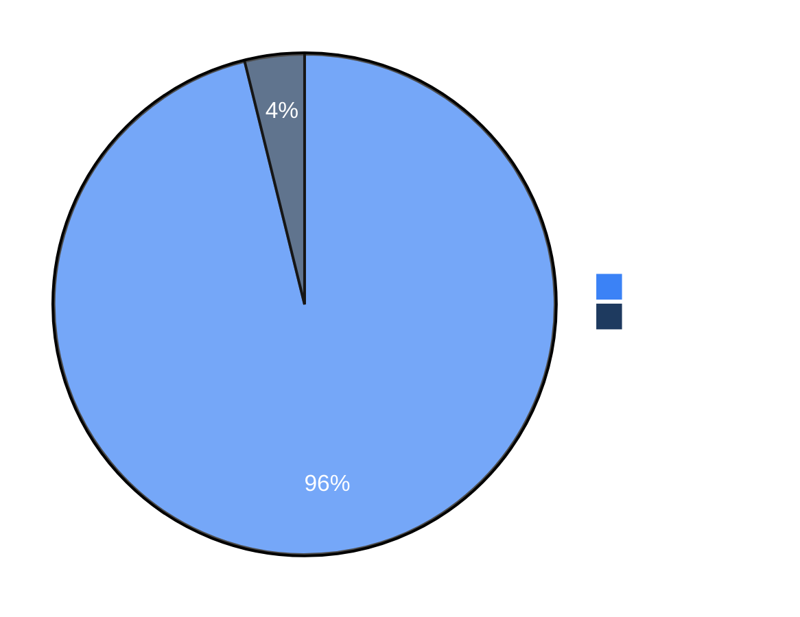

# Benchmarks

We use security benchmarks to track Strix's capabilities and improvements over time. We plan to add more benchmarks, both existing ones and our own, to help the community evaluate and compare security agents.

## Reproducing this benchmark

The numbers below are pending re-verification through an in-repo,
reproducible harness: **[`benchmarks/xben/`](xben/README.md)**. That harness
is the source of truth going forward — it validates committed per-challenge
run records against a JSON Schema, mechanically regenerates the table below
from them, and has a `--check` mode that fails loudly if the committed data
doesn't back up the claim. This closes out the intent of
[usestrix/strix#1263](https://github.com/usestrix/strix/issues/1263) and
[usestrix/strix#1264](https://github.com/usestrix/strix/issues/1264), which
asked for exactly this: the headline number below currently has no committed
data reproducing it in this repository, only the hand-typed table that
follows and a link to an external repo. See `benchmarks/xben/README.md` for
how to run it and why `--check` currently (correctly) fails against the
fixture data checked in so far.

## Full Details

For the complete benchmark results, evaluation scripts, and run data, see the [usestrix/benchmarks](https://github.com/usestrix/benchmarks) repository.

> [!NOTE]
> We are actively adding more benchmarks to our evaluation suite.

## Results

> [!NOTE]
> These numbers are hand-typed and **pending re-verification** via
> `benchmarks/xben/` (see above). Treat them as a historical claim, not yet
> as independently reproducible from data committed to this repository.

| Benchmark | Challenges | Success Rate |
|-----------|------------|--------------|
| [XBEN](https://github.com/usestrix/benchmarks/tree/main/XBEN) | 104 | **96%** |

### XBEN

The [XBOW benchmark](https://github.com/usestrix/benchmarks/tree/main/XBEN) is a set of 104 web security challenges designed to evaluate autonomous penetration testing agents. Each challenge follows a CTF format where the agent must discover and exploit vulnerabilities to extract a hidden flag.

Strix `v0.4.0` achieved a **96% success rate** (100/104 challenges) in black-box mode.

**Performance by Difficulty:**

| Difficulty | Solved | Success Rate |
|------------|--------|--------------|
| Level 1 (Easy) | 45/45 | 100% |
| Level 2 (Medium) | 49/51 | 96% |
| Level 3 (Hard) | 6/8 | 75% |

**Resource Usage:**
- Average solve time: ~19 minutes
- Total cost: ~$337 for 100 challenges
