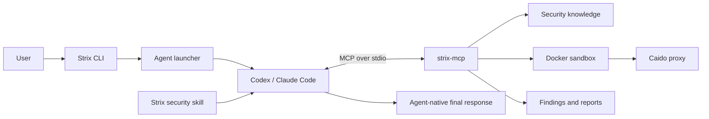

<Warning>
This integration is a skeleton and proof of concept. It demonstrates that Strix can move model reasoning into Codex, Claude Code, or another MCP-capable coding agent while retaining the Strix sandbox, proxy, security knowledge, findings, and report artifacts. It is usable for experimentation, but it does not yet provide complete behavioral parity with the legacy Strix multi-agent runtime. Review the limitations and roadmap before relying on it for production assessments.
</Warning>

## Goal

The coding-agent runtime removes the requirement for Strix to hold a separate model-provider API key. Instead of constructing and running an OpenAI Agents SDK model inside Strix, it uses an already authenticated coding agent as the reasoning and orchestration layer.

The implementation separates the application into two parts:

- **Skill:** teaches the host coding agent how to conduct a Strix assessment, enforce scope, select security knowledge, validate findings, and finish the report.
- **MCP server:** exposes model-free Strix operations such as scan initialization, Docker sandbox execution, Caido traffic inspection, security knowledge retrieval, finding persistence, and report generation.

All LLM inference in this mode happens inside the selected coding agent. The `strix-mcp` process does not instantiate a model, call a model endpoint, or require `LLM_API_KEY`, `OPENAI_API_KEY`, or `ANTHROPIC_API_KEY`.

The coding agent still needs its normal authentication, subscription, or provider configuration. “No model API key” means that Strix does not need an additional provider credential; it does not mean that Codex or Claude Code can operate without being authenticated.

## Current status

This proof of concept establishes the following architecture and compatibility points:

- The existing `strix --target ...` entry point can launch Codex or Claude Code.
- The same target types, scan modes, instruction input, diff scoping, Docker sandbox, Caido proxy, vulnerability artifacts, and final report format are reused.
- The skill and MCP server can be installed separately and invoked directly from an agent.
- The MCP server has a real stdio protocol boundary and can be used by clients other than the built-in launcher.
- MCP-mode vulnerability deduplication cannot silently fall back to a Strix-owned model call.

It does **not** yet mean that the legacy agent graph, interactive TUI, conversation persistence, cost accounting, or autonomous subagent behavior have been reproduced exactly. Those gaps are intentional and documented below.

## Architecture



### Responsibility split

| Component | Responsibility | Does it call an LLM? |
| --- | --- | --- |
| `strix` CLI | Parse existing arguments, select a runtime, ensure Docker is available, and launch the coding agent | No |
| Agent launcher | Build an ephemeral MCP configuration and a scan prompt for Codex or Claude Code | No |
| Codex / Claude Code | Plan the assessment, reason over evidence, choose tools, optionally coordinate native subagents, and write report narratives | Yes, through the agent's own authenticated runtime |
| `strix-security` skill | Provide the scan workflow, safety constraints, reporting quality bar, and MCP usage instructions | No |
| `strix-mcp` | Expose Strix capabilities through MCP and own one active scan lifecycle | No |
| Docker sandbox | Execute security tooling in isolation and route HTTP traffic through Caido | No |
| Report state | Persist targets, findings, SARIF, CSV/JSON/Markdown, and final report sections | No |

## Runtime selection

The CLI supports four values for `--agent`:

| Value | Behavior |
| --- | --- |
| `auto` | Use legacy mode when `STRIX_LLM` is configured; otherwise select a coding-agent CLI |
| `codex` | Explicitly launch Codex and inject an ephemeral Strix MCP server |
| `claude` | Explicitly launch Claude Code and inject an ephemeral Strix MCP server |
| `legacy` | Use the existing in-process provider and OpenAI Agents SDK runtime |

When coding-agent selection is automatic, `STRIX_AGENT` is checked first. If it is not set, Strix selects `codex` when available, followed by `claude`.

```bash
# Automatically use an installed coding agent when STRIX_LLM is unset
strix --target ./your-app

# Select a host explicitly
strix --agent codex --target ./your-app
strix --agent claude --target https://staging.example.com

# Force the previous direct-provider runtime
strix --agent legacy --target ./your-app
```

## End-to-end execution flow

### 1. CLI parsing and compatibility

The existing argument parser still processes targets, instructions, scan mode, scope mode, diff base, mounts, budget, and resume options. In coding-agent mode, the launcher converts those values into a structured `start_scan` call embedded in the initial agent prompt.

For Codex, the launcher passes an ephemeral `mcp_servers.strix` configuration through Codex configuration overrides. For Claude Code, it passes an inline JSON MCP configuration with `--mcp-config`. The prompt is separated from Claude's variadic config arguments with `--`, preventing Claude from interpreting the prompt as another configuration filename.

### 2. Skill loading

The launcher tells the coding agent to read the packaged `strix-security/SKILL.md` before acting. The same skill can also be installed into the agent's normal skill directory for direct invocation.

The skill requires the agent to:

1. Respect the verified target scope.
2. Start the MCP scan lifecycle once.
3. Load only relevant Strix security knowledge.
4. Build and execute a test plan.
5. Validate suspected issues with safe, reproducible proofs of concept.
6. Review existing findings before filing another.
7. Produce a customer-facing final report.
8. Stop and persist the run if the assessment cannot be completed.

The skill is intentionally concise. Detailed tool selection and CVSS field guidance live in `references/mcp-tools.md` and are loaded only when needed.

### 3. Scan initialization

The agent calls `start_scan`. The MCP service then:

1. Validates scan mode and target input.
2. Infers each target type using existing Strix logic.
3. Resolves and deduplicates local paths and mounts.
4. Clones remote repository targets when necessary.
5. Rewrites localhost targets to `host.docker.internal` for access from Docker.
6. Applies the existing local-copy size limit.
7. Resolves full, automatic, or explicit diff scope.
8. Creates or hydrates `ReportState` under `strix_runs/<run-name>`.
9. Starts the existing Strix Docker sandbox and Caido sidecar.
10. Returns the authorized scope, task, output directory, and `/workspace/<name>` mappings to the coding agent.

One MCP server process owns one active scan at a time. A second `start_scan` call is rejected until the current scan is finished or stopped.

### 4. Security execution

The coding agent calls `sandbox_exec` with an argv array. Commands execute inside the existing Strix security container rather than directly in the host-agent workspace.

The sandbox retains the existing tooling model:

- source targets are copied or mounted under `/workspace`;
- common reconnaissance and security tools are available;
- browser automation runs through the `agent-browser` CLI;
- Python and curl can be used for custom validation;
- HTTP and HTTPS traffic are routed through the in-container Caido proxy.

The proof of concept currently supports bounded, synchronous command execution. It does not expose the legacy `write_stdin`/interactive-process lifecycle through MCP yet.

### 5. Proxy inspection and replay

Traffic produced in the sandbox is available through MCP wrappers around the existing Caido API:

- list captured requests with HTTPQL filters;
- inspect request or response bodies with pagination or regex search;
- replay a request with URL, parameter, header, cookie, or body changes;
- browse the generated sitemap;
- create and manage Caido scope rules.

This preserves the existing browser → capture → inspect → modify → validate workflow while allowing the host coding agent to drive it.

### 6. Knowledge loading

Strix's existing security Markdown library remains the knowledge source. `list_knowledge` exposes available framework, technology, protocol, tooling, cloud, and vulnerability modules. `load_knowledge` returns one exact module on demand.

Scan-mode guidance is also loaded through the same mechanism, for example:

```text
scan_modes/quick
scan_modes/standard
scan_modes/deep
frameworks/nextjs
protocols/graphql
vulnerabilities/idor
tooling/agent_browser
```

The host agent's native web-search capability should be used for current external research. The Perplexity-backed legacy `web_search` tool is not exposed by this MCP skeleton.

### 7. Finding creation

`create_vulnerability_report` reuses the existing Strix validation, CVSS calculation, artifact generation, and `ReportState` persistence code.

MCP mode explicitly sets `allow_model_dedupe=false`. This is important: the existing semantic dedupe implementation can call the configured Strix model, which would violate the agent-native model boundary. The proof of concept therefore performs exact normalized duplicate detection on title, target, endpoint, and method. The coding agent is responsible for semantic review through `list_findings` before filing.

Reports still require:

- a verified title and affected target;
- technical analysis and impact;
- a working PoC description and payload/code;
- remediation guidance;
- all eight CVSS 3.1 base metrics;
- repository-relative code locations for white-box findings.

### 8. Finalization and artifacts

The agent calls `finish_scan` with four report sections:

- executive summary;
- methodology;
- consolidated technical analysis;
- prioritized recommendations.

Strix marks the run complete, writes its normal artifacts, and tears down the sandbox. `stop_scan` provides the incomplete-run path and preserves state before cleanup.

Artifacts remain under `strix_runs/<run-name>`:

```text
strix_runs/<run-name>/
├── run.json
├── penetration_test_report.md
├── findings.sarif
├── vulnerabilities.csv
├── vulnerabilities.json
└── vulnerabilities/
    └── vuln-0001.md
```

## MCP tool surface

The proof-of-concept server exposes 15 tools:

| Tool | Purpose |
| --- | --- |
| `start_scan` | Create or resume report state and start the sandbox |
| `sandbox_exec` | Execute argv-form commands inside the sandbox |
| `list_knowledge` | List built-in Strix security modules |
| `load_knowledge` | Load one knowledge module |
| `list_proxy_requests` | Query captured traffic using HTTPQL |
| `view_proxy_request` | Read a captured request or response |
| `repeat_proxy_request` | Replay captured traffic with modifications |
| `list_sitemap` | Browse the Caido sitemap hierarchy |
| `view_sitemap_entry` | Inspect one sitemap entry and recent traffic |
| `manage_scope` | Manage Caido allow/deny scope rules |
| `create_vulnerability_report` | Validate and persist one verified finding |
| `list_findings` | Review already persisted findings |
| `scan_status` | Inspect lifecycle state and output location |
| `finish_scan` | Complete reports and clean up the sandbox |
| `stop_scan` | Persist an incomplete run and clean up the sandbox |

The server uses newline-delimited JSON-RPC over stdio. Its local transport reads and writes pipe file descriptors through the event loop because the worker-thread-backed stdio wrapper can hang in some managed shells. The protocol and FastMCP server core remain standard MCP.

## Installation

### Prerequisites

- Docker installed and running.
- Strix installed in the current Python environment.
- Codex or Claude Code installed and authenticated.
- The coding agent allowed to start the local stdio MCP process.

The packaged commands are:

```text
strix             Existing CLI plus coding-agent runtime selection
strix-mcp         Local MCP stdio server
strix-skill-path  Prints the packaged portable skill directory
```

### Use the normal CLI

No separate skill or MCP registration is required when using `strix --agent ...`; the launcher injects both the prompt and an ephemeral MCP configuration.

```bash
strix --agent codex -t ./app -t https://staging.example.com
strix --agent claude -t ./app -t http://localhost:8080
strix --agent codex --resume previous-run-name
```

### Install into Codex

```bash
codex mcp add strix -- strix-mcp
mkdir -p ~/.codex/skills
cp -R "$(strix-skill-path)" ~/.codex/skills/strix-security
```

Then ask:

```text
Use $strix-security to run an authorized assessment of ./your-app.
```

### Install into Claude Code

```bash
claude mcp add --scope user strix -- strix-mcp
mkdir -p ~/.claude/skills
cp -R "$(strix-skill-path)" ~/.claude/skills/strix-security
```

Then ask:

```text
Use /strix-security to run an authorized assessment of ./your-app.
```

### Install into another coding agent

Configure a local stdio MCP server with `strix-mcp` as its command. Attach `strix-security/SKILL.md` through that agent's reusable instruction or skill mechanism. The minimum client requirements are:

- MCP tool discovery and invocation over stdio;
- local subprocess support;
- permission to start Docker-backed operations;
- sufficient tool-call and context limits for a security assessment.

The built-in launcher currently has adapters only for Codex and Claude Code. Other agents use manual MCP/skill configuration in this skeleton.

## What remains compatible

- Local code, Git repository, URL, domain, IP, and combined target input.
- `quick`, `standard`, and `deep` scan modes.
- Inline and file-based instructions.
- Full, automatic, and explicit diff scope.
- Read-only mounts for large repositories.
- Localhost target access from the sandbox.
- Docker isolation, browser tooling, and Caido capture/replay.
- PoC, CVSS, code-location, remediation, SARIF, CSV, JSON, and Markdown outputs.
- Report-state hydration through `--resume` or `start_scan(resume=true)`.

## Proof-of-concept limitations

This integration should be treated as a foundation to perfect, not as finished runtime parity.

### Orchestration

- The host coding agent replaces the Strix `AgentCoordinator` and SDK runner.
- Strix does not currently persist or restore the host agent's conversation.
- `--resume` restores Strix targets, findings, configuration, and reports, but starts a new coding-agent reasoning session unless the user separately resumes that agent's session.
- Native Codex/Claude subagents may be used, but their topology and status are not recorded in Strix's legacy `agents.json` graph.
- There is no MCP equivalent of the legacy agent messaging, waiting, interruption, or child lifecycle tools.

### User experience

- The coding agent owns the interactive UI; the Strix TUI and live agent graph are not active in this mode.
- Output, approval prompts, token visibility, and cancellation behavior differ by host agent.
- `--max-budget-usd` is forwarded only where the host exposes an equivalent option. Host subscription usage is not tracked in Strix's LLM ledger.

### Tool parity

- `sandbox_exec` is synchronous and bounded; background process handles and `write_stdin` are not exposed.
- Strix notes and todos are not exposed because the host agent normally provides planning primitives.
- Legacy Perplexity web search is not exposed; the host's native web capability is expected instead.
- Semantic model-based finding deduplication is replaced by deterministic exact matching plus agent review.

### Portability and hardening

- Only Codex and Claude Code have built-in launcher adapters.
- Client-specific permission policies and MCP timeouts require more compatibility testing.
- Windows and macOS installation, Docker networking, and path behavior need dedicated end-to-end coverage.
- The server currently keeps scan state in process-global objects and supports one active scan per process.
- Abrupt host-agent termination can leave a container running until cleanup is invoked or Docker reaps it.
- Automated end-to-end tests should launch a real sandbox, generate proxy traffic, file a finding, finish, resume, and verify cleanup.

## Recommended next steps

1. Add a runtime abstraction so legacy and MCP orchestration share an explicit interface instead of branching at the CLI boundary.
2. Add background command sessions and stdin streaming to the MCP execution API.
3. Persist agent-runtime metadata and provide a host-session resume contract.
4. Add deterministic and/or host-assisted semantic deduplication without a hidden Strix model call.
5. Restore observability with host-reported token/usage metadata where clients expose it.
6. Add structured progress events for TUI or agent UI integration.
7. Add adapters and conformance tests for additional coding agents.
8. Add Docker-backed end-to-end CI for source, web, proxy replay, reporting, resume, and cleanup.
9. Threat-model MCP arguments, report content, host permissions, and sandbox escape boundaries.
10. Decide whether legacy provider mode remains supported long-term or becomes a separate optional package/runtime.

## Troubleshooting

### Inspect the packaged skill

```bash
strix-skill-path
```

### Verify agent MCP registration

```bash
codex mcp get strix
claude mcp get strix
```

### Run the MCP server directly

`strix-mcp` is a stdio process and normally appears to wait silently. That is expected: it is waiting for an MCP client to send an initialize request. Do not use ordinary terminal output as a health check.

### Force a runtime

If a saved `STRIX_LLM` configuration causes `auto` to choose legacy mode, explicitly pass:

```bash
strix --agent codex --target ./your-app
# or
strix --agent claude --target ./your-app
```

### Preserve incomplete work

If the agent is still responsive, instruct it to call `stop_scan`. This persists the run record before tearing down the container. If the process was killed, inspect Docker for a stranded sandbox and use the normal Strix/Docker cleanup procedure.
